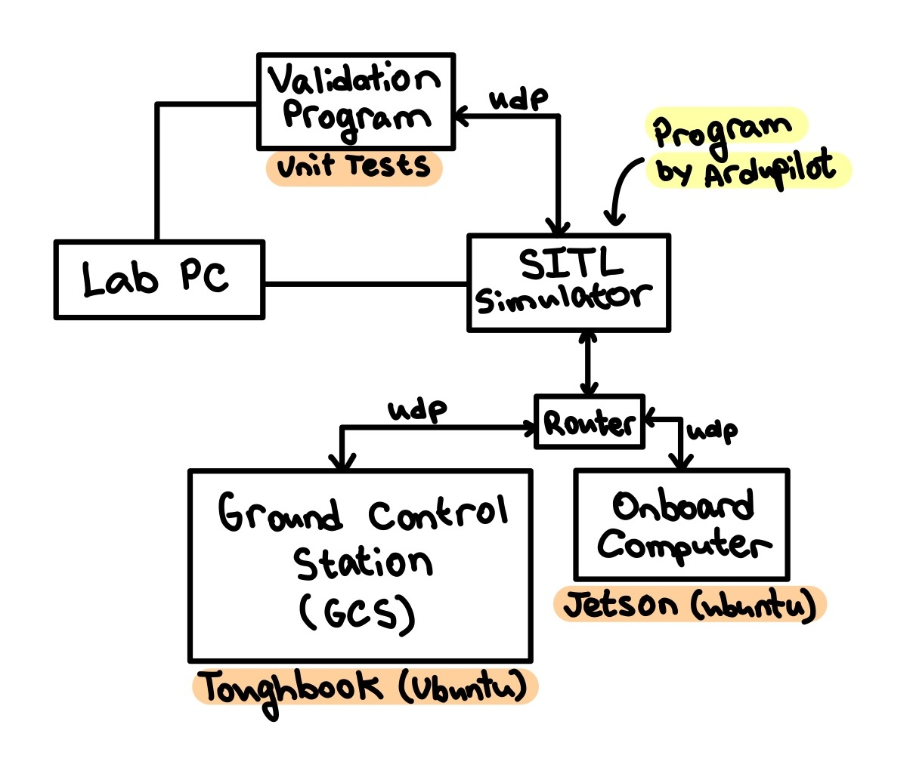

# GNC Knowledge Base 26

## Resources
**[GNC Goals](/docs/gnc_goals.md)**

[Setting up your environment](/docs/env_setup.md)

[Helpful Terms and Definitions](/docs/terms_and_def.md)

[Install and Use TMUX](/docs/tmux_setup.md)

[Setup UART on Raspberry Pi](/docs/uart_pi_setup.md)

[Create a Personal Access Token Github](https://docs.github.com/en/authentication/keeping-your-account-and-data-secure/managing-your-personal-access-tokens#creating-a-personal-access-token-classic)
(Use this as your password when you `git clone`)

[MAVProxy Cheatsheet](https://ardupilot.org/mavproxy/docs/getting_started/cheatsheet.html)

## Helpful links
[Ardupilot Copter Docs](https://ardupilot.org/copter/)

[SITL Simulator](https://ardupilot.org/dev/docs/sitl-simulator-software-in-the-loop.html)

[MAVLink Messages](https://mavlink.io/en/messages/common.html)

[GPX Editor](https://gpx.studio/app)

## General Info

- Main dragram of setup simplified

- Diagram of testing setup

# knowledge_base
